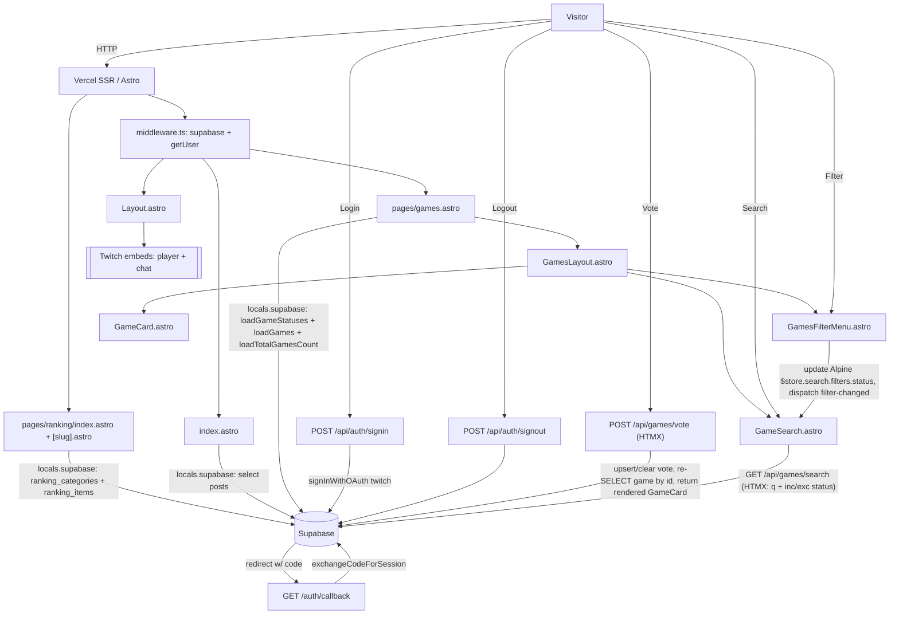

# Architecture

Knekro Hub is a server-rendered Astro site for Twitch streamer Knekro. It surfaces a live Twitch embed + posts feed
(`/`), a browsable library of games played on stream (`/games`) with community voting, and a separate rankings and awards section
(`/ranking`) covering Game of the Year (`/ranking/goty`) and custom yearly category tracks. Supabase provides Postgres + Twitch
OAuth; Vercel hosts the SSR output. Core constraints: small dependency surface, all data reads server-side, Postgres
queries must be column-scoped and index-aware, and the schema is meant to stay maintainable and extensible.

## Data flow

## Modules

| Module                         | Responsibility                                                                                                                                                                                      | Depends on                                         | Depended on by                                     |
| ------------------------------ | --------------------------------------------------------------------------------------------------------------------------------------------------------------------------------------------------- | -------------------------------------------------- | -------------------------------------------------- |
| `src/middleware.ts`            | Request interceptor: initializes `createSupabaseServerClient`, validates session via `getUser`, clears expired tokens via local signout, exposes `locals.user` & `locals.supabase`                  | `createSupabaseServerClient`                       | all pages, layouts                                 |
| `layouts/Layout.astro`         | Shell: head, nav, footer, auth UI switch (reads `Astro.locals.user`)                                                                                                                                | `LoginButton`, `UserMenu`, `styles/`               | all pages                                          |
| `pages/index.astro`            | Home: Twitch player+chat embeds, posts feed                                                                                                                                                         | `Astro.locals.supabase`, Layout                    | —                                                  |
| `pages/games.astro`            | Games library page: SSR loaders (`loadGameStatuses`, `loadGames`, `loadTotalGamesCount`), Alpine store init (`games.layout`, `search`), renders `GamesLayout`                                       | `Astro.locals`, `lib/games`, `GamesLayout`, Layout | —                                                  |
| `pages/ranking/*`              | Rankings hub (`/ranking`) & standalone category pages (`goty.astro`, `vuela-alto.astro`, fallback `[slug].astro`)                                                                                   | Layout, `components/ranking/*`, `lib/ranking`      | —                                                  |
| `pages/api/auth/*`             | `signin` (Twitch OAuth), `signout`                                                                                                                                                                  | `lib/db-client`                                    | LoginButton/UserMenu forms                         |
| `pages/auth/callback.ts`       | OAuth PKCE code→session exchange                                                                                                                                                                    | `lib/db-client`                                    | Supabase redirect                                  |
| `pages/api/games/vote.astro`   | POST a game vote (or clear on re-click): upsert `games_user_votes`, re-SELECT game by id, return server-rendered `GameCard` (HTMX outerHTML swap)                                                   | `Astro.locals`, `lib/games`, `GameCard`            | `GameCard` vote buttons (HTMX)                     |
| `pages/api/games/status.astro` | POST game status update for owners/managers with append-only audit logging in `audit_logs`, return server-rendered `GameStatusEditor` (HTMX outerHTML swap)                                         | `Astro.locals`, `lib/games`, `lib/roles`           | `GameStatusEditor` options (HTMX)                  |
| `lib/db-client.ts`             | Per-request SSR database client with placeholder fallback. Browser client retained for non-vote direct reads.                                                                                       | `@supabase/ssr`, `@supabase/supabase-js`           | all pages, client scripts                          |
| `lib/games.ts`                 | Server-side `/games` loader: `loadGameStatuses`, `loadGames`, `loadGameById` (single game, same projection), `updateGameStatusWithAudit`, `loadTotalGamesCount`; `formatAvg` helper                 | `types`, `@supabase/supabase-js`                   | `pages/games.astro`, `api/games/*`                 |
| `lib/roles.ts`                 | Server-side RBAC helpers: `loadUserRoles`, `loadUserRoleNames`, `userHasRole`, `userHasAnyRole`, `loadAllRoles`                                                                                     | `types`, `@supabase/supabase-js`                   | `pages/games/[id].astro`, `api/games/*`            |
| `lib/ranking.ts`               | Server-side `/ranking` helpers: `loadRankingCategories`, `loadRankingCategoryBySlug`, `loadPodiumGames`, `assignPodiumGame`, `removePodiumGame`                                                     | `types`, `@supabase/supabase-js`                   | `pages/ranking/*`, `api/ranking/*`                 |
| `pages/api/games/search.astro` | GET paginated name search + status filtering (`q`, `inc`, `exc`): SELECT matching games (+ `user_vote` when logged in) + count, return rendered cards + OOB counter/no-results swaps                | `Astro.locals`, `GameCard`                         | search input (HTMX)                                |
| `types/*`                      | Domain types (`games.ts`, `categories.ts`, `streams.ts`, `ranking.ts`, `roles.ts`, `audit.ts`, `db.ts`), Alpine stores (`store.ts`), barrel `index.ts`                                              | —                                                  | `games` via `lib/games.ts`, Alpine store consumers |
| `components/*`                 | Global shell UI: `LoginButton`, `UserMenu`, `TwitchLogo`, `Spinner`                                                                                                                                 | —                                                  | Layout                                             |
| `components/games/*`           | Games UI suite: `GamesLayout`, `GamesFilterMenu`, `GameSearch`, `GameCard`, `GameCover`, `GameStatusBadge`, `GameStatusEditor`, `GameCommunityVotesBadge`, `GameUserVoteBadge`, `VoteOverlay`       | `types`, `lib/games`                               | `pages/games.astro`, `api/games/*`                 |
| `components/ranking/*`         | Rankings UI suite: `RankingHub`, `RankingCategoryPanel`, `RankingSectionLayout`, `RankingPodium`, `RankingPodiumSlot`, `RankingGameCard`, `RankingSearch`, `RankingSentinel`, `RankingPodiumScript` | `types`, `lib/ranking`                             | `pages/ranking/*`, `api/ranking/*`                 |
| `styles/*`                     | `global.css` entry → `tokens.css` (design tokens), `base.css` (incl. `[x-cloak]`), `utilities.css`; per-page `pages/games.css`, `pages/ranking.css`                                                 | Tailwind v4                                        | Layout (`global.css`); pages                       |

## Key decisions (inferred)

- **Astro SSR + Vercel adapter** (`output:"server"`): per-request session + fresh data without a client SPA. See
  `docs/adr/0001-astro-ssr.md`.
- **Supabase for data + Twitch OAuth**: single backend; Twitch is the only login provider (audience = Twitch community).
  See `docs/adr/0002-twitch-only-auth.md`.
- **Per-request SSR client & Middleware**: `src/middleware.ts` runs on every request to initialize the client and verify
  auth via `getUser()`. It exposes `context.locals.supabase` and `context.locals.user`. Stale or expired tokens trigger
  local signout in the middleware before response streaming starts, preventing `ResponseSentError`.
- **Placeholder-fallback client**: `lib/db-client.ts` falls back to a valid dummy URL/key so pages render while env vars
  provision. Intentional.
- **`/games` reads live data**: `lib/games.ts` queries `game_status` + `games` (PostgREST embedding
  `game_status!game_status_id`, bounded). Community averages come from the DB-maintained `vote_count`/`avg_vote`
  columns on `games`; the signed-in user's votes come from `games_user_votes`.
- **Community voting (DB-first)**: votes 1–10 stored in `games_user_votes`; the community average (1 decimal) is shown
  to everyone, voting controls to signed-in users only. The `on_vote_change` trigger keeps `games.vote_count`/`avg_vote`
  in sync. Voting is DB-first: `POST /api/games/vote` upserts the vote (re-clicking the current vote clears it), then
  re-SELECTs the game by id and returns a server-rendered `GameCard` that HTMX swaps in via `outerHTML` — no client-side
  Supabase writes, no optimistic average math, no imperative DOM patching.
- **HTMX + Alpine for `/games` progressive interactivity**: The games library combines Alpine for reactive client UI
  state
  with HTMX for server round-trips and HTML fragment swapping:
  - **Alpine stores & local state**:
    - `$store.games.layout`: tracks responsive viewport (`isDesktop`) and filter drawer visibility
      (`gamesFilterMenuOpen`).
    - `$store.search`: tracks input query (`query`) and status filter sets (`filters.status.included` and
      `filters.status.excluded`).
    - `GamesFilterMenu.astro` modifies status sets via `toggle(id, mode)` or `reset()`, then dispatches a
      `filter-changed` event to `document.body`.
    - `GameCard.astro` manages local popover state (`open`) for the `VoteOverlay`.
  - **HTMX communication**:
    - `GameSearch.astro` listens for input changes (debounced 300ms) and `filter-changed from:body`, bundling
      `$store.search.query`, `inc`, and `exc` sets into query parameters via `hx-vals="js:..."`.
    - `GET /api/games/search.astro` filters rows server-side via Supabase and returns server-rendered `<GameCard>`
      components, simultaneously updating `#visible-count`, `#total-count`, and `#filter-no-results` via out-of-band
      swaps (`hx-swap-oob`).
    - `VoteButton.astro` submits votes via `POST /api/games/vote` with outerHTML swapping of the updated card.
- **Tailwind v4 token-only theming**: no config file; all theme lives in `src/styles/tokens.css` as `--knk-*` vars.

## Risks / tech debt (by blast radius)

| Rank | Issue                                                                                                               | Impact                              |
| ---- | ------------------------------------------------------------------------------------------------------------------- | ----------------------------------- |
| 1    | `/games` queries `games` (`id, name, cover_url`, FK `game_status_id`); cards are not links (no `/games/[id]` route) | Feature incomplete                  |
| 2    | `Layout.astro` places `<main>`/`<footer>` outside `</body></html>`                                                  | Invalid HTML structure; fix markup  |
| 3    | `posts` table queried but no TS type; `goty` unwired                                                                | Type safety gap; incomplete feature |
| 4    | No tests, near-empty README                                                                                         | Low automated safety net            |

## Dependency freshness

Astro 7, Tailwind 4, `@supabase/*` current at commit. No deprecated deps observed. Re-check on major bumps
(Astro/Tailwind move fast).
