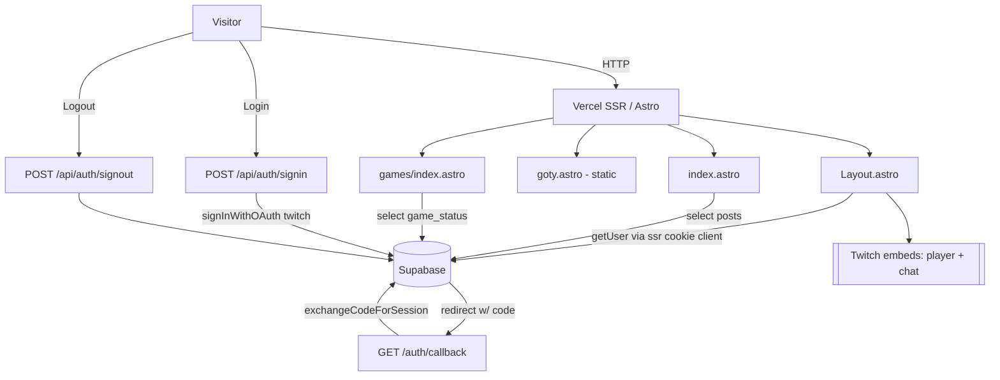

# Architecture

Knekro Hub is a server-rendered Astro site for Twitch streamer Knekro. It surfaces a live Twitch embed + posts feed (`/`), a browsable library of games played on stream (`/games`), and a separate awards section (`/goty`) covering Game of the Year, "Ojeadita of the Year", and per-genre picks. Supabase provides Postgres + Twitch OAuth; Vercel hosts the SSR output. Core constraints: small dependency surface, all data reads server-side, Postgres queries must be column-scoped and index-aware, and the schema is meant to stay maintainable and extensible.

## Data flow

## Modules

| Module | Responsibility | Depends on | Depended on by |
|---|---|---|---|
| `layouts/Layout.astro` | Shell: head, nav, footer, session (`getUser`), auth UI switch | `@supabase/ssr`, `LoginButton`, `UserMenu`, `global.css` | all pages |
| `pages/index.astro` | Home: Twitch player+chat embeds, posts feed | `lib/supabase`, Layout | — |
| `pages/games/index.astro` | Games library: status filters (live), grid (placeholder) | `lib/supabase`, `types`, Layout | — |
| `pages/goty.astro` | GOTY awards (static placeholder) | Layout | — |
| `pages/api/auth/*` | `signin` (Twitch OAuth), `signout` | `@supabase/ssr` | LoginButton/UserMenu forms |
| `pages/auth/callback.ts` | OAuth PKCE code→session exchange | `@supabase/ssr` | Supabase redirect |
| `lib/supabase.ts` | Browser Supabase client (anon key) + safe placeholder fallback | `@supabase/supabase-js` | `index`, `games` |
| `types/index.ts` | Domain interfaces (`Game`, `GameStatus`, `GotyItem`, `StreamLog`, `Category`) | — | `games` (others aspirational) |
| `components/*` | `LoginButton`, `UserMenu`, `TwitchLogo` | — | Layout |
| `styles/global.css` | `--knk-*` design tokens, `.knk-notch` shapes | Tailwind v4 | Layout |

## Key decisions (inferred)
- **Astro SSR + Vercel adapter** (`output:"server"`): per-request session + fresh data without a client SPA. See `docs/adr/0001-astro-ssr.md`.
- **Supabase for data + Twitch OAuth**: single backend; Twitch is the only login provider (audience = Twitch community). See `docs/adr/0002-twitch-only-auth.md`.
- **`@supabase/ssr` cookie clients** created per request in Layout + each API route (not shared) — correct for SSR, but duplicated (see risks).
- **Placeholder-fallback client**: `lib/supabase.ts` and server clients fall back to a valid dummy URL/key so pages render while env vars provision. Intentional.
- **Tailwind v4 token-only theming**: no config file; all theme lives in `global.css` as `--knk-*` vars.

## Risks / tech debt (by blast radius)
| Rank | Issue | Impact |
|---|---|---|
| 1 | `createServerClient` boilerplate duplicated in `Layout` + 3 API routes | Drift, inconsistent cookie handling; extract one helper |
| 2 | Inconsistent keys: `lib/supabase.ts` uses `ANON`, server clients use `PUBLISHABLE` | Confusing; pick one convention |
| 3 | `games/index.astro` uses `select("*")` + hardcoded card, not real data | Violates query rule; feature incomplete |
| 4 | `Layout.astro` places `<main>`/`<footer>` outside `</body></html>` | Invalid HTML structure; fix markup |
| 5 | `posts` table queried but no TS type; `goty` unwired | Type safety gap; incomplete feature |
| 6 | No tests, near-empty README | Low automated safety net |

## Dependency freshness
Astro 7, Tailwind 4, `@supabase/*` current at commit. No deprecated deps observed. Re-check on major bumps (Astro/Tailwind move fast).
