# Architecture

Knekro Hub is a server-rendered Astro site for Twitch streamer Knekro. It surfaces a live Twitch embed + posts feed
(`/`), a browsable library of games played on stream (`/games`) with community voting, and a separate awards section
(`/goty`) covering Game of the Year, "Ojeadita of the Year", and per-genre picks. Supabase provides Postgres + Twitch
OAuth; Vercel hosts the SSR output. Core constraints: small dependency surface, all data reads server-side, Postgres
queries must be column-scoped and index-aware, and the schema is meant to stay maintainable and extensible.

## Data flow

```mermaid
flowchart TD
    U[Visitor] -->|HTTP| V["Vercel SSR / Astro"]
    V --> L["Layout.astro"]
    V --> Pi["index.astro"] -->|" dbClient: getUser + select posts "| SB[(Supabase)]
    V --> Pg["pages/games.astro"]
    Pg -->|" dbClient: getUser + loadGameStatuses + loadGames + loadTotalGamesCount "| SB
    Pg --> GL["GamesLayout.astro"]
    GL --> GFM["GamesFilterMenu.astro"]
    GL --> GS["GameSearch.astro"]
    GL --> GC["GameCard.astro"]
    V --> Pgo["goty.astro - static"]
    U -->|Login| AS["POST /api/auth/signin"] -->|" signInWithOAuth twitch "| SB
    SB -->|" redirect w/ code "| CB["GET /auth/callback"] -->|exchangeCodeForSession| SB
    U -->|Logout| AO["POST /api/auth/signout"] --> SB
    U -->|Vote| PV["POST /api/games/vote (HTMX)"] -->|" upsert/clear vote, re-SELECT game by id, return rendered GameCard "| SB
    U -->|Search| GS -->|" GET /api/games/search (HTMX: q + inc/exc status) "| SB
    U -->|Filter| GFM -->|" update Alpine $store.search.filters.status, dispatch filter-changed "| GS
    L --> TW[[Twitch embeds: player + chat]]
```

## Modules

| Module                         | Responsibility                                                                                                                                                                          | Depends on                                          | Depended on by                                                 |
| ------------------------------ | --------------------------------------------------------------------------------------------------------------------------------------------------------------------------------------- | --------------------------------------------------- | -------------------------------------------------------------- |
| `layouts/Layout.astro`         | Shell: head, nav, footer, auth UI switch                                                                                                                                                | `LoginButton`, `UserMenu`, `styles/`                | all pages                                                      |
| `pages/index.astro`            | Home: Twitch player+chat embeds, posts feed                                                                                                                                             | `lib/db-client`, Layout                             | —                                                              |
| `pages/games.astro`            | Games library page: SSR loaders (`loadGameStatuses`, `loadGames`, `loadTotalGamesCount`), Alpine store init (`games.layout`, `search`), renders `GamesLayout`                           | `lib/db-client`, `lib/games`, `GamesLayout`, Layout | —                                                              |
| `pages/goty.astro`             | GOTY awards (static placeholder)                                                                                                                                                        | Layout                                              | —                                                              |
| `pages/api/auth/*`             | `signin` (Twitch OAuth), `signout`                                                                                                                                                      | `lib/db-client`                                     | LoginButton/UserMenu forms                                     |
| `pages/auth/callback.ts`       | OAuth PKCE code→session exchange                                                                                                                                                        | `lib/db-client`                                     | Supabase redirect                                              |
| `pages/api/games/vote.astro`   | POST a game vote (or clear on re-click): upsert `games_user_votes`, re-SELECT game by id, return server-rendered `GameCard` (HTMX outerHTML swap)                                       | `lib/db-client`, `lib/games`, `GameCard`            | `GameCard` vote buttons (HTMX)                                 |
| `lib/db-client.ts`             | Per-request SSR database client with placeholder fallback. Browser client retained for non-vote direct reads.                                                                           | `@supabase/ssr`, `@supabase/supabase-js`            | all pages, client scripts                                      |
| `lib/games.ts`                 | Server-side `/games` loader: `loadGameStatuses`, `loadGames`, `loadGameById` (single game, same projection), `loadTotalGamesCount`; `formatAvg` helper                                  | `types`, `@supabase/supabase-js`                    | `pages/games.astro`, `api/games/*`                             |
| `pages/api/games/search.astro` | GET paginated name search + status filtering (`q`, `inc`, `exc`): SELECT matching games (+ `user_vote` when logged in) + count, return rendered cards + OOB counter/no-results swaps    | `lib/db-client`, `GameCard`                         | search input (HTMX)                                            |
| `types/*`                      | Domain types (`games.ts`, `categories.ts`, `streams.ts`, `goty.ts`, `db.ts`), Alpine stores (`store.ts`), barrel `index.ts`                                                             | —                                                   | `games` via `lib/games.ts`, Alpine store consumers             |
| `components/*`                 | Global shell UI: `LoginButton`, `UserMenu`, `TwitchLogo`                                                                                                                                | —                                                   | Layout                                                         |
| `components/games/*`           | Games UI suite: `GamesLayout`, `GamesFilterMenu`, `GameSearch`, `GameCard`, `GameCover`, `GameStatusBadge`, `GameCommunityVotesBadge`, `GameUserVoteBadge`, `VoteOverlay`, `VoteButton` | `types`, `lib/games`                                | `pages/games.astro`, `api/games/*`                             |
| `styles/*`                     | `global.css` entry → `tokens.css` (design tokens), `base.css` (incl. `[x-cloak]`), `utilities.css`; per-page `pages/games.css`                                                          | Tailwind v4                                         | Layout (`global.css`); `pages/games.astro` (`pages/games.css`) |

## Key decisions (inferred)

- **Astro SSR + Vercel adapter** (`output:"server"`): per-request session + fresh data without a client SPA. See
  `docs/adr/0001-astro-ssr.md`.
- **Supabase for data + Twitch OAuth**: single backend; Twitch is the only login provider (audience = Twitch community).
  See `docs/adr/0002-twitch-only-auth.md`.
- **Per-request SSR client**: `lib/db-client.ts` creates one auth-aware client per request via `@supabase/ssr`, used for
  both auth and data queries including vote writes. Carries the user JWT so RLS policies apply. No browser-side Supabase
  client is used for votes anymore (votes go through SSR API endpoints).
- **Placeholder-fallback client**: `lib/db-client.ts` falls back to a valid dummy URL/key so pages render while env vars
  provision. Intentional.
- **`/games` reads live data**: `lib/games.ts` queries `game_status` + `games` (PostgREST embedding
  `game_status!game_status_id`, bounded). Community averages come from the DB-maintained `vote_count`/`avg_vote`
  columns on `games`; the signed-in user's votes come from `games_user_votes`.
- **Community voting (DB-first)**: votes 1–10 stored in `games_user_votes`; the community average (1 decimal) is shown
  to everyone, voting controls to signed-in users only. The `on_vote_change` trigger keeps `games.vote_count`/`avg_vote`
  in sync. Voting is DB-first: `POST /api/games/vote` upserts the vote (re-clicking the current vote clears it), then
  re-SELECTs the game by id and returns a server-rendered `GameCard` that HTMX swaps in via `outerHTML` — no client-side
  Supabase writes, no optimistic average math, no imperative DOM patching.
- **HTMX + Alpine for `/games` progressive interactivity**: The games library combines Alpine for reactive client UI
  state
  with HTMX for server round-trips and HTML fragment swapping:
  - **Alpine stores & local state**:
    - `$store.games.layout`: tracks responsive viewport (`isDesktop`) and filter drawer visibility
      (`gamesFilterMenuOpen`).
    - `$store.search`: tracks input query (`query`) and status filter sets (`filters.status.included` and
      `filters.status.excluded`).
    - `GamesFilterMenu.astro` modifies status sets via `toggle(id, mode)` or `reset()`, then dispatches a
      `filter-changed` event to `document.body`.
    - `GameCard.astro` manages local popover state (`open`) for the `VoteOverlay`.
  - **HTMX communication**:
    - `GameSearch.astro` listens for input changes (debounced 300ms) and `filter-changed from:body`, bundling
      `$store.search.query`, `inc`, and `exc` sets into query parameters via `hx-vals="js:..."`.
    - `GET /api/games/search.astro` filters rows server-side via Supabase and returns server-rendered `<GameCard>`
      components, simultaneously updating `#visible-count`, `#total-count`, and `#filter-no-results` via out-of-band
      swaps (`hx-swap-oob`).
    - `VoteButton.astro` submits votes via `POST /api/games/vote` with outerHTML swapping of the updated card.
- **Tailwind v4 token-only theming**: no config file; all theme lives in `src/styles/tokens.css` as `--knk-*` vars.

## Risks / tech debt (by blast radius)

| Rank | Issue                                                                                                               | Impact                              |
| ---- | ------------------------------------------------------------------------------------------------------------------- | ----------------------------------- |
| 1    | `/games` queries `games` (`id, name, cover_url`, FK `game_status_id`); cards are not links (no `/games/[id]` route) | Feature incomplete                  |
| 2    | `Layout.astro` places `<main>`/`<footer>` outside `</body></html>`                                                  | Invalid HTML structure; fix markup  |
| 3    | `posts` table queried but no TS type; `goty` unwired                                                                | Type safety gap; incomplete feature |
| 4    | No tests, near-empty README                                                                                         | Low automated safety net            |

## Dependency freshness

Astro 7, Tailwind 4, `@supabase/*` current at commit. No deprecated deps observed. Re-check on major bumps
(Astro/Tailwind move fast).
