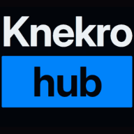
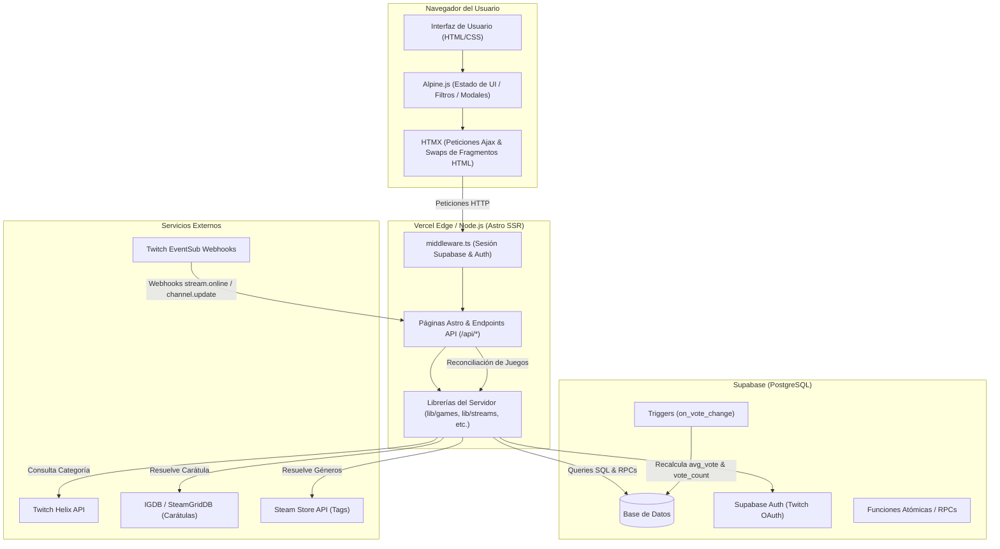
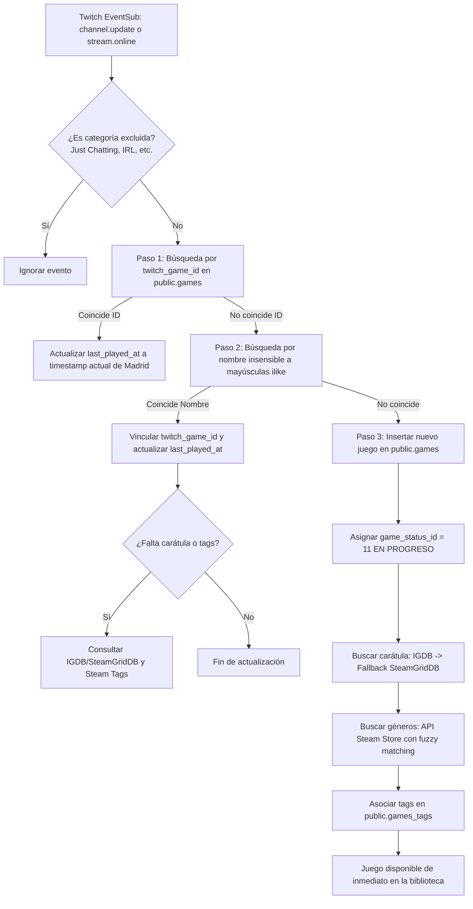

# Knekro Hub

<p style="text-align: center">
  
</p>

<p style="text-align: center">
  <strong>Web hub y plataforma comunitaria para el canal de <a href="https://www.twitch.tv/knekro" style="cursor: pointer">Twitch de Knekro</a>.</strong><br>
  Contiene la biblioteca de juegos que ha ido jugando (desde 2026) con sistema de votación comunitaria e información de dicho juego (estado, última vez jugado...), calendario de emisiones en directo con desglose cronológico y gala de premios/rankings anuales (GOTY y categorías temáticas).
</p>

<p style="text-align: center">
  <a href="https://astro.build"></a>
  <a href="https://supabase.com"></a>
  <a href="https://tailwindcss.com"></a>
  <a href="https://www.typescriptlang.org"></a>
  <a href="https://dev.twitch.tv"></a>
  <a href="https://htmx.org"></a>
  <a href="https://alpinejs.dev"></a>
  <a href="https://vercel.com"></a>
  <a href="LICENSE"></a>
</p>

---

## 📌 Motivo

<p>
Como ingeniero de software quería hacer alguna web y se me ocurrió hacer esta aplicación para Knekro, ya que vi que 
había un archivo Excel con la información que había de sus streams y los juegos que había jugado, quería ver qué se
podía hacer a nivel de desarrollo web.
</p>
<p>
Y obviamente también buscar alguna manera de agradecer las horas de contenido de este titán.
</p>
<p>
El propósito es totalmente <strong>educativo</strong> y <strong>no comercial</strong> (a pesar de lo que diga el chat).
</p>

---

## 📑 Tabla de Contenidos

- [Visión General](#-visión-general)
- [Arquitectura Técnica](#-arquitectura-técnica)
- [Integración con Twitch](#-integración-con-twitch)
- [Sincronización Automática de Juegos](#-sincronización-automática-de-juegos)
- [Estados de los Juegos](#-estados-de-los-juegos)
- [Votaciones de la Comunidad](#-votaciones-de-la-comunidad)
- [Ficha y Detalles de los Juegos](#-ficha-y-detalles-de-los-juegos)
- [Páginas de la Aplicación y Recolección de Datos](#-páginas-de-la-aplicación-y-recolección-de-datos)
- [Historial de Emisiones e Inicio de Datos](#-historial-de-emisiones-e-inicio-de-datos)
- [Puesta en Marcha en Local](#-puesta-en-marcha-en-local)
- [Documentación Adicional](#-documentación-adicional)
- [Licencia y Contribuciones (CLA)](#-licencia-y-contribuciones-cla)

---

## 🌟 Visión General

**Knekro Hub** es una aplicación web renderizada en servidor (SSR) diseñada específicamente para la comunidad del streamer **Knekro**.

Proporciona un registro exhaustivo y automatizado de la actividad del canal de Twitch:

1. **Catálogo de Juegos**: Biblioteca navegable con filtrado multi-criterio avanzado, buscador en tiempo real y carátulas de alta resolución.
2. **Valoración Comunitaria**: Los espectadores autenticados con su cuenta de Twitch pueden calificar cada juego del 1 al 10, generando notas medias transparentes e instantáneas.
3. **Seguimiento de Emisiones**: Calendario mensual con desglose interactivo de cada sesión de streaming, juegos jugados y duración exacta de cada categoría.
4. **Rankings y Premios Anuales (GOTY)**: Espacio de premiación con podios interactivos olímpicos (Oro, Plata, Bronce) para coronar los mejores juegos del año y categorías temáticas.

---

## 🛠 Arquitectura Técnica

El proyecto prioriza una superficie de dependencias reducida, rendimiento óptimo en servidor y persistencia reactiva sin la sobrecarga de una Single Page Application (SPA) pesada.



### Stack Principal

- **Framework Web**: [Astro 5](https://astro.build) configurado en modo SSR (`output: "server"`) desplegado en [Vercel](https://vercel.com).
- **Base de Datos y Auth**: [Supabase](https://supabase.com) (PostgreSQL, Row Level Security, Triggers y autenticación mediante Twitch OAuth 2.0).
- **Estilos y Diseño**: [Tailwind CSS v4](https://tailwindcss.com) utilizando tokens semánticos puros en CSS (`src/styles/tokens.css`) sin fichero de configuración JS.
- **Interactividad Progresiva**:
  - [HTMX](https://htmx.org) para intercambios de fragmentos HTML renderizados en servidor (`hx-swap="outerHTML"` / `innerHTML`), eliminando la necesidad de reconstruir JSON en cliente.
  - [Alpine.js](https://alpinejs.dev) para reactividad ligera en cliente (estados de menús, filtros tri-estado, drawers y modales).
- **Iconografía**: [`@lucide/astro`](https://lucide.dev) renderizada directamente en SVG optimizado sin coste de JavaScript en cliente.

---

## 🟣 Integración con Twitch

La integración con Twitch es el núcleo funcional del hub, dividida en cuatro pilares:

### 1. Autenticación Twitch OAuth (PKCE)

- El acceso de usuarios se realiza exclusivamente mediante **Twitch OAuth 2.0**, conectando directamente a los miembros de la comunidad con su identidad de Twitch.
- El flujo utiliza `@supabase/ssr` con cookies seguras en el servidor y validación mediante `getUser()` en `src/middleware.ts`.
- Permite identificar de manera unívoca a los votantes y otorgar roles administrativos (`owner`, `manager`) mediante control de acceso basado en roles (RBAC).

### 2. Webhooks en Tiempo Real (Twitch EventSub)

El servidor expone el endpoint `/api/webhooks/twitch` para recibir notificaciones automáticas y seguras desde la infraestructura de Twitch:

- **Verificación de Seguridad HMAC-SHA256**: Cada petición entrante valida los encabezados `twitch-eventsub-message-signature`, `twitch-eventsub-message-timestamp` e `id` contra el secreto configurado (`TWITCH_EVENTSUB_SECRET`). Las peticiones no autorizadas o con marcas de tiempo desfasadas son rechazadas inmediatamente.
- **Eventos Monitorizados**:
  - `stream.online`: Notifica el inicio de una emisión en directo. Abre un nuevo registro en la tabla `streams` con la fecha y hora local de Madrid (`Europe/Madrid`), cierra emisiones previas huérfanas y consulta la categoría inicial.
  - `channel.update`: Notifica en tiempo real cada vez que Knekro cambia de juego, categoría o título en su canal. Registra la transición en `twitch_channel_update` y lanza la conciliación automática del juego.
  - `stream.offline`: Notifica el fin de la emisión y actualiza el campo `ended_at` del directo activo.

### 3. Twitch Helix API

- Utilizado por el servidor para resolver metadatos directos del streamer (`broadcaster_id`), verificar el estado actual del directo y consultar la categoría activa cuando `stream.online` no incluye el payload completo.

### 4. Reproductores y Chat Integrados

- En la página principal (`/`), se embeben los componentes oficiales de Twitch (reproductor de vídeo y chat en directo interactivo), adaptados al tema visual oscuro de la plataforma y acompañados de un indicador de directo con temporizador dinámico de duración.

---

## 🔄 Sincronización Automática de Juegos

Uno de los mayores atractivos técnicos de Knekro Hub es su capacidad para **detectar y dar de alta automáticamente cualquier juego nuevo que Knekro pruebe en directo**.



### Proceso Paso a Paso:

1. **Filtro de Categorías No-Juego**:  
   Se ignoran automáticamente categorías de charla o no lúdicas (ej. _Just Chatting_, _Eventos Especiales_, _IRL_, _ASMR_, _Ciencia y Tecnología_).
2. **Conciliación por ID de Twitch (`twitch_game_id`)**:  
   Si el juego ya fue registrado previamente con ese ID de Twitch, se actualiza su marca temporal `last_played_at`.
3. **Conciliación por Nombre (`ilike`)**:  
   Si no se localiza por ID (por ejemplo, si el juego fue introducido manualmente en la base de datos con anterioridad), se busca por coincidencia de nombre. Al coincidir, se guarda su `twitch_game_id` para futuras detecciones y se rellenan carátula o tags si estaban pendientes.
4. **Alta Automática de Nuevos Juegos**:  
   Si el juego no existe en el catálogo:
   - Se inserta en la tabla `games` con el estado inicial predeterminado **`EN PROGRESO`** (ID: 11) y la fecha de inicio del directo.
   - **Resolución de Carátula**: Se consulta en primer lugar la API de **IGDB** (mediante credenciales de Twitch) buscando una carátula oficial en formato WebP de alta resolución (`t_cover_big`). Si no existe en IGDB, se recurre automáticamente a **SteamGridDB** como proveedor alternativo (imágenes verticales 600x900).
   - **Extracción de Géneros/Tags**: Se conecta con la API de búsqueda de la tienda de **Steam** mediante un algoritmo de similitud difusa (distancia Levenshtein sobre títulos normalizados). Al encontrar el título correspondiente, se extraen sus etiquetas y se insertan en las tablas `tags` y `games_tags`.

---

## 🏷 Estados de los Juegos

Cada juego dentro de la plataforma cuenta con un estado que describe la experiencia o resultado de Knekro al jugarlo. Existen **12 estados oficiales**:

|  ID  | Nombre del Estado          | Descripción                                                                                                           |
| :--: | :------------------------- | :-------------------------------------------------------------------------------------------------------------------- |
| `1`  | **COMPLETADO**             | Juego finalizado y superado en stream de principio a fin.                                                             |
| `2`  | **VUELA ALTO**             | Juego abandonado, dropeado o descartado por no convencer a Knekro.                                                    |
| `3`  | **#AD**                    | Directo patrocinado o colaboración comercial promocional.                                                             |
| `4`  | **ROGUELIKE RUN COMPLETA** | Run completada con éxito alcanzando la victoria en un roguelike.                                                      |
| `5`  | **ROGUELIKE RUN A MEDIAS** | Partida a un roguelike no finalizada o run incompleta.                                                                |
| `6`  | **EVENTO**                 | Emisiones especiales, galas, presentaciones o torneos puntuales.                                                      |
| `7`  | **OJEADITA**               | Primer vistazo rápido, primeras impresiones o prueba breve.                                                           |
| `8`  | **EARLY ACCESS**           | Juego probado durante su fase de acceso anticipado o desarrollo activo.                                               |
| `9`  | **DEMO**                   | Demostración jugable probada en directo.                                                                              |
| `10` | **BETA**                   | Versión de prueba preliminar cerrada o pública.                                                                       |
| `11` | **EN PROGRESO**            | Juego que se está jugando actualmente (**estado asignado por defecto** al sincronizarse un nuevo juego desde Twitch). |
| `12` | **EVENTUALMENTE**          | Título pausado temporalmente con intención declarada de retomarse a futuro.                                           |

### Filtrado y Gestión de Estados:

- **Filtrado Tri-Estado en `/games`**: El panel de filtros de la biblioteca permite incluir (`+`), excluir (`-`) o mantener en estado neutro cada uno de los estados, permitiendo búsquedas complejas (ej. "Juegos _COMPLETADOS_, excluyendo _#AD_ y _DEMOS_").
- **Edición Administrativa con Auditoría**: Los usuarios con rol `owner` o `manager` disponen de un selector interactivo en la ficha del juego (`/games/[id]`) para modificar el estado en caliente. Cada modificación se registra de forma inmutable en la tabla `audit_logs` guardando el usuario, el estado anterior y el nuevo estado.

---

## ⭐ Votaciones de la Comunidad

El sistema de valoración de Knekro Hub permite a la comunidad puntuar los juegos jugados en directo, garantizando una nota media fiable y dinámica.

### Reglas y Mecánica del Voto:

- **Autenticación Requerida**: Es indispensable iniciar sesión con Twitch para poder emitir un voto, previniendo abusos y duplicidades.
- **Rango de Calificación**: Escala de números enteros del **1 al 10**.
- **Acción Desmarcar (Toggle / Unvote)**: Si el usuario vuelve a hacer clic sobre la nota que tiene asignada, el voto se retira automáticamente, quedando el juego sin valorar por su parte.
- **Arquitectura DB-First e Intercambio HTMX**: La votación se envía mediante una petición `POST /api/games/vote`. El backend realiza un `upsert` en la tabla `games_user_votes`, vuelve a consultar el juego y devuelve el fragmento HTML del componente (`GameCard` o `GameDetailVoting`) completamente renderizado, el cual HTMX sustituye en el DOM (`hx-swap="outerHTML"`). No hay cálculos matemáticos optimistas en cliente ni riesgo de desincronización.
- **Cálculo Automático en Postgres**: Un trigger en la base de datos (`on_vote_change`) recalcula inmediatamente el recuento total de votos (`vote_count`) y la media ponderada (`avg_vote`) en la tabla `games`.
- **Formateo de la Nota Media**: Los promedios se muestran con un máximo de un decimal (ej. `8.4`), salvo que la media sea un número entero exacto, en cuyo caso se presenta sin decimales (ej. `8`), gracias a la función de formateo `formatAvg`.

---

## 🎮 Ficha y Detalles de los Juegos

Al acceder a la ficha individual de un juego (`/games/[id]`), se despliega una vista exhaustiva servida atómicamente por la función Postgres `get_game_by_id`:

- **Carátula en Alta Definición**: Presentación en proporción 2:3 con soporte para carga optimizada (`eager` o `lazy`) y carátula por defecto si no estuviera disponible.
- **Etiquetas y Géneros (Steam Tags)**: Listado interactivo de las categorías del juego obtenidas de Steam. Muestra las primeras 5 etiquetas con un botón expansor `...` para revelar la totalidad de tags sin romper el diseño.
- **Estado Actual y Editor**: Insignia con el estado del juego. Para administradores (`owner` o `manager`), se habilita el botón de edición rápida.
- **Módulo de Puntuación**: Muestra la nota media de la comunidad, el número total de votos emitidos y la botonera del 1 al 10 para votar o cambiar la calificación personal.
- **Historial de Emisiones en Directo**: Sección que lista en orden cronológico inverso todos los streams registrados en los que Knekro estuvo jugando a ese título específico, indicando la fecha, hora y enlace directo al desglose de dicha emisión.

---

## 🧭 Páginas de la Aplicación y Recolección de Datos

A continuación se detalla cada una de las rutas públicas de la plataforma, su finalidad, qué información recopilan o presentan y cómo lo hacen:

| Ruta              | Nombre                     | Finalidad y Uso                                                                                                     | Datos que Recopila y Muestra                                                                                                                                                                       | Método de Recolección                                                                                                                                                             |
| :---------------- | :------------------------- | :------------------------------------------------------------------------------------------------------------------ | :------------------------------------------------------------------------------------------------------------------------------------------------------------------------------------------------- | :-------------------------------------------------------------------------------------------------------------------------------------------------------------------------------- |
| `/`               | **Inicio**                 | Portada del canal. Muestra si Knekro está en directo, reproductor de vídeo, chat de Twitch y últimas publicaciones. | Estado del streaming activo (`streams`), contador de tiempo transcurrido y últimas 10 publicaciones de la comunidad (`posts`).                                                                     | Consulta directa en servidor SSR a Supabase en paralelo (`Promise.all`).                                                                                                          |
| `/games`          | **Biblioteca de Juegos**   | Catálogo general de todos los títulos jugados en el canal. Búsqueda y filtrado exhaustivo.                          | Listado paginado de juegos (nombre, carátula, nota media, votos totales, estado y voto del usuario si está logueado), listado de estados y listado de géneros/tags.                                | Carga inicial SSR (24 juegos) con preferencias de ordenación leídas de cookie (`knk_games_preferences`). Paginación y filtros reactivos mediante HTMX contra `/api/games/search`. |
| `/games/[id]`     | **Ficha de Juego**         | Vista detallada de un juego en particular.                                                                          | Carátula en alta resolución, etiquetas de Steam, estado, puntuación comunitaria, voto personal e historial de emisiones donde se jugó.                                                             | Función atómica PostgreSQL `get_game_by_id(p_game_id, p_user_id)` ejecutada en servidor SSR.                                                                                      |
| `/streams`        | **Calendario de Directos** | Calendario mensual interactivo (grilla LUN–DOM) que documenta los días que Knekro ha emitido.                       | Días con stream, duración total de cada sesión, carátulas de los juegos jugados en el día, panel deslizante con actividades cronológicas y ranking mensual de los juegos con más horas de emisión. | RPC `get_streams_by_date_range(p_start_date, p_end_date)` en SSR + drawer interactivo con Alpine.js.                                                                              |
| `/streams/[id]`   | **Detalle de Emisión**     | Desglose minucioso de una sesión de streaming específica.                                                           | Hora de inicio, hora de finalización, duración total del directo y línea temporal cronológica con cada cambio de categoría/juego y su duración calculada.                                          | RPC `get_stream_by_id(p_stream_id)` con cálculo de segmentos de tiempo en servidor (`calculateActivitySegments`).                                                                 |
| `/ranking`        | **Hub de Rankings**        | Panel principal de premios y clasificaciones anuales organizadas por pistas/categorías.                             | Tarjetas de categorías activas (`ranking_categories`), descripción, carátula y accesos a las galas de premios.                                                                                     | Consulta en servidor a `ranking_categories`.                                                                                                                                      |
| `/ranking/goty`   | **Gala GOTY**              | Clasificación del Juego del Año (Game of the Year) elegido por el usuario.                                          | Podio olímpico (Oro, Plata, Bronce) personalizado del usuario logueado (`ranking_items`) y selector con buscador de juegos candidatos.                                                             | Lectura de `ranking_items` filtrado por usuario y año en SSR; asignación y reordenación vía SortableJS y `/api/ranking/podium`.                                                   |
| `/ranking/[slug]` | **Categorías Temáticas**   | Rankings temáticos dedicados: _Vuela Alto_ (`/ranking/vuela-alto`), _Roguelike_, _Terror_, _Incremental_, etc.      | Podio del usuario y piscina de juegos filtrados por estado o etiquetas temáticas correspondientes.                                                                                                 | Consultas unificadas a `ranking_items` y `games` filtrados por tags o estados mediante `lib/ranking.ts`.                                                                          |
| `/404`            | **Error 404**              | Página amigable de recurso no encontrado (_"¿Cómo salgo de la tetera?"_).                                           | Emote personalizado y botón de retorno al inicio.                                                                                                                                                  | Renderizado estático en cliente.                                                                                                                                                  |

---

## 📅 Historial de Emisiones e Inicio de Datos

> [!IMPORTANT]
> **Fecha de Inicio de Recolección de Directos: 14 de septiembre de 2026**  
> El primer directo registrado en la plataforma comenzó el **14 de septiembre de 2026 a las 17:44:13 (hora de Madrid)**.

### ¿Por qué no aparecen emisiones en `/streams` antes de esa fecha?

El sistema de seguimiento de directos y cambios de juego está basado en **Twitch EventSub Webhooks**.

1. **Naturaleza en Tiempo Real de EventSub**: Twitch EventSub es un protocolo de notificación "push" basado en eventos. Envía mensajes exclusivamente en el instante en que ocurren los sucesos (`stream.online`, `channel.update`, `stream.offline`).
2. **Ausencia de Ingesta Histórica Retroactiva**: La API de Twitch EventSub no proporciona un historial pasado de emisiones ni permite descargar retrospectivamente eventos ocurridos con anterioridad a la creación de las suscripciones.
3. **Inicio de Registro**: Las suscripciones a los webhooks de Knekro se activaron formalmente el 14 de septiembre de 2026. En consecuencia, el calendario de `/streams` y las líneas temporales de emisión muestran datos con total exactitud desde ese momento en adelante, pero no disponen de registros previos a esa fecha.

---

## 🚀 Puesta en Marcha en Local

### Requisitos Previos

- [Node.js](https://nodejs.org) (v20 o superior recomendado).
- Gestor de paquetes [pnpm](https://pnpm.io) (o `npm`).

### 1. Clonar el Repositorio

```bash
git clone https://github.com/danygq/knekro-hub.git
cd knekro-hub
```

### 2. Instalar Dependencias

```bash
pnpm install
```

### 3. Configurar Variables de Entorno

Crea un archivo `.env.local` en la raíz del proyecto tomando como referencia las credenciales de tu proyecto de Supabase y tu aplicación de Twitch Developer:

```env
# Supabase (Públicas para cliente y SSR)
PUBLIC_SUPABASE_URL="https://tu-proyecto.supabase.co"
PUBLIC_SUPABASE_ANON_KEY="tu-clave-anon"

# Supabase Admin (Sólo servidor - para webhooks y tareas administrativas)
SUPABASE_SERVICE_ROLE_KEY="tu-service-role-key"

# Twitch API & Webhooks
TWITCH_CLIENT_ID="tu-twitch-client-id"
TWITCH_CLIENT_SECRET="tu-twitch-client-secret"
TWITCH_EVENTSUB_SECRET="tu-clave-secreta-eventsub"
TWITCH_BROADCASTER_ID="152633332"

# SteamGridDB (Opcional - Fallback de carátulas)
STEAMGRIDDB_API_KEY="tu-api-key-sgdb"
```

### 4. Ejecutar en Modo Desarrollo

```bash
pnpm run dev
```

La aplicación estará disponible de inmediato en [http://localhost:4321](http://localhost:4321).

### 5. Compilar para Producción

```bash
pnpm run build
pnpm run preview
```

---

## 📚 Documentación Adicional

Para agentes de Inteligencia Artificial y desarrolladores que contribuyan al repositorio:

- **[`AGENTS.md`](AGENTS.md)**: Reglas de desarrollo, convenciones obligatorias y zonas protegidas.
- **[`ARCHITECTURE.md`](ARCHITECTURE.md)**: Mapa integral de la arquitectura del sistema y flujo de datos.
- **[`docs/INDEX.md`](docs/INDEX.md)**: Índice completo de documentación técnica modular (capa de datos, optimización de consultas SQL, autenticación y rankings).
- **[`docs/AGENT_PROTOCOL.md`](docs/AGENT_PROTOCOL.md)**: Protocolo de trabajo para creación de ramas, commits y pull requests.

---

## 📄 Licencia y Contribuciones (CLA)

Este proyecto es de código abierto y se distribuye bajo los términos de la licencia **[MIT](LICENSE)**.

### Contributor License Agreement (CLA)

Para garantizar la sostenibilidad del proyecto, protegerlo jurídicamente y permitir que el titular del proyecto (**Dani / `danygq`**) mantenga la propiedad intelectual y pueda en el futuro ceder, donar o transferir la titularidad y los derechos a terceros si así lo decide sin bloqueos legales, todas las contribuciones externas se rigen por el **[Contributor License Agreement (CLA)](CLA.md)**.

Al enviar un _Pull Request_ o colaborar con código en este repositorio, aceptas los términos del [CLA](CLA.md), cediendo los derechos patrimoniales sobre tus aportaciones al titular del proyecto, quien a su vez se compromete a mantener el proyecto público y accesible bajo licencia de código abierto.
