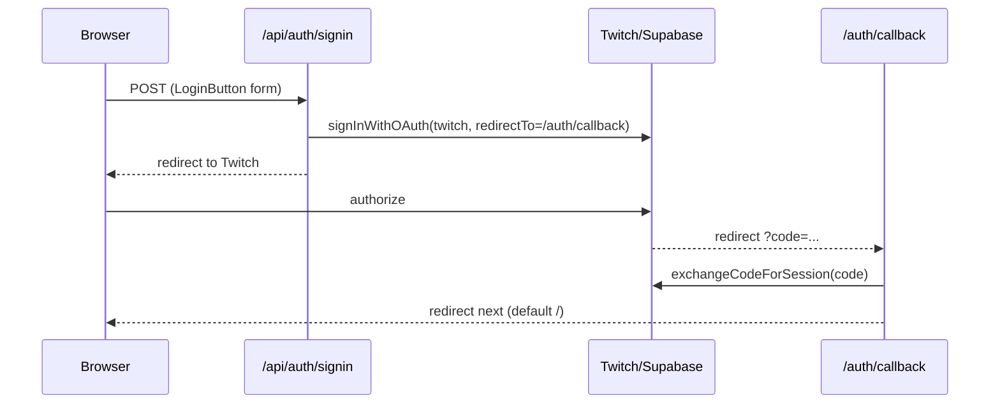

# Auth

Supabase Auth, **Twitch OAuth only** (`provider: "twitch"`). SSR cookie-based sessions via `@supabase/ssr`.

## Flow

Sign out: `POST /api/auth/signout` → `supabase.auth.signOut()` → redirect `/`.
Errors: missing/invalid `code` → redirect `/auth/auth-code-error`.

## Session read

`Layout.astro` builds a per-request `createServerClient` and calls `getUser()` (wrapped in `.catch` → `{user:null}` so
provisioning/network failures never break render). `user` toggles `UserMenu` vs `LoginButton`.

## Cookie client contract

Every server client passes `cookies.getAll` (from request `Cookie` header via `parseCookieHeader`) + `cookies.setAll`
(writes to Astro `cookies`). Uses `PUBLIC_SUPABASE_URL` + `PUBLIC_SUPABASE_PUBLISHABLE_KEY`.

## Debt

This exact `createServerClient` block is duplicated in `Layout.astro`, `callback.ts`, `signin.ts`, `signout.ts`. Extract
a `createSupabaseServerClient({ request, cookies })` helper in `src/lib/`; keep per-request instantiation.

## Do not

Do not add other providers, magic links, or client-side auth without an explicit request — Twitch-only is intentional
(`docs/adr/0002-twitch-only-auth.md`).
