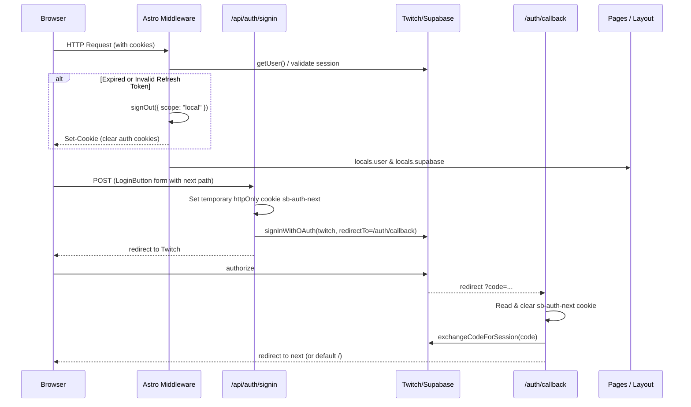

# Auth

Supabase Auth, **Twitch OAuth only** (`provider: "twitch"`). SSR cookie-based sessions via `@supabase/ssr` and Astro middleware.

## Flow

- **Sign in**: `POST /api/auth/signin` captures `next` route from form data or query parameter and stores it in a short-lived `sb-auth-next` cookie. The `redirectTo` target URL passed to Supabase remains strictly `${origin}/auth/callback` (without query parameters) to guarantee an exact match against Supabase's allowed Redirect URLs list.
- **Callback**: `GET /auth/callback` exchanges `code` for session, extracts and cleans up `sb-auth-next` (falling back to `?next=` if present), sanitizes the path, and redirects the user to their destination.
- **Sign out**: `POST /api/auth/signout` → `supabase.auth.signOut()` → redirect `/`.
- **OAuth errors**: missing/invalid `code` → redirect `/auth/auth-code-error`.
- **Expired sessions**: detected in Astro middleware (`src/middleware.ts`) via `isSessionExpiredError(error)` → triggers `signOut({ scope: "local" })` before response streaming starts, clearing invalid cookies without crashing with `ResponseSentError`. Protected endpoints (such as `vote.astro`) redirect unauthenticated requests to `/auth/session-expired`.

## Session read & Error handling

Session authentication is handled uniformly in **Astro middleware** (`src/middleware.ts`) before any page or component executes:

1. **Client & Session Initialization**:
   The middleware instantiates `createSupabaseServerClient(context.request, context.cookies)` and verifies the session via `supabase.auth.getUser()`.
   The initialized client and user are set on `context.locals`:
   - `context.locals.supabase`
   - `context.locals.user`
2. **Active session**:
   Returns `{ data: { user } }`. Pages and layouts read `Astro.locals.user` to render user profile data in `UserMenu`.
3. **Unauthenticated / no session**:
   `@supabase/ssr` returns `AuthSessionMissingError`. Handled gracefully with `user: null`, rendering `LoginButton`.
4. **Expired / invalid session token**:
   Detected via `isSessionExpiredError(error)` (checks `session_expired`, `bad_jwt`, `refresh_token_not_found`, HTTP 401/403). The middleware invokes `signOut({ scope: "local" })` before headers stream, clearing stale cookies from the browser. The request continues as an unauthenticated guest (`user: null`), avoiding `ResponseSentError`.
5. **Network / transient failures**:
   Detected as retryable fetch or 5xx server errors. Handled gracefully as `{ user: null }` so connectivity dips do not break site rendering.
6. **Layout & Component Decoupling**:
   `Layout.astro` and child components do NOT call async auth methods or mutate cookies. They consume `Astro.locals.user` (or `Astro.props.user`), guaranteeing safe SSR streaming without `ResponseSentError`.

## Cookie client contract

The helper `createSupabaseServerClient(request, cookieStore)` in `src/lib/createSupabaseServerClient.ts` centralizes client instantiation across middleware and API routes.
It handles `cookies.getAll` (from request `Cookie` header via `parseCookieHeader`) and `cookies.setAll` (writes to Astro `cookies`, guarded with `try / catch` against late streaming writes). Uses `PUBLIC_SUPABASE_URL` + `PUBLIC_SUPABASE_PUBLISHABLE_KEY`.

`src/lib/db-client.ts` re-exports `createSupabaseServerClient` (as well as the legacy alias `createDbClient`) and `supabaseClient` for browser-side usage.

## Do not

Do not add other providers, magic links, or client-side auth without an explicit request — Twitch-only is intentional (`docs/adr/0002-twitch-only-auth.md`).
