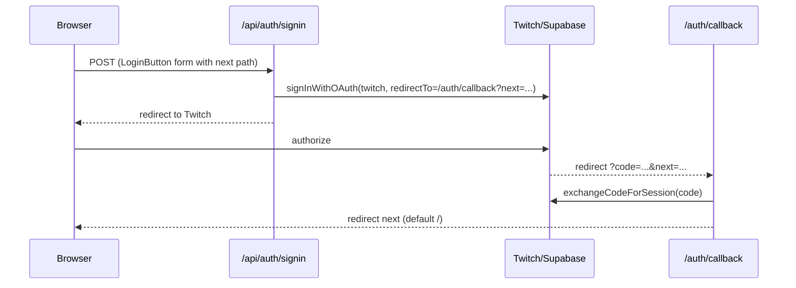

# Auth

Supabase Auth, **Twitch OAuth only** (`provider: "twitch"`). SSR cookie-based sessions via `@supabase/ssr`.

## Flow



- **Sign in**: `POST /api/auth/signin` captures `next` route from form data or query parameter and sets `redirectTo: /auth/callback?next=...`.
- **Sign out**: `POST /api/auth/signout` → `supabase.auth.signOut()` → redirect `/`.
- **OAuth errors**: missing/invalid `code` → redirect `/auth/auth-code-error`.
- **Expired sessions**: detected in `Layout.astro` or page frontmatter via `isSessionExpiredError(error)` → triggers `signOut({ scope: "local" })` to clear cookies and redirects to `/auth/session-expired?next=...`.

## Session read & Error handling

`Layout.astro` (or page frontmatter when `user` is needed for data queries like `games.astro`) creates a per-request SSR client via:
```ts
createSupabaseServerClient(Astro.request, Astro.cookies)
```
and calls `getUser()`.

1. **Active session**: returns `{ data: { user } }`, used to display `UserMenu`.
2. **Unauthenticated / no session**: `@supabase/ssr` returns `AuthSessionMissingError`. Handled gracefully with `user: null`, rendering `LoginButton`.
3. **Expired / invalid session token**: detected via `isSessionExpiredError(error)` (checks `session_expired`, `bad_jwt`, `refresh_token_not_found`, HTTP 401/403). The client invokes `signOut({ scope: "local" })` to clear stale cookies and redirects to `/auth/session-expired?next=...`.
4. **Network / transient failures**: detected as retryable fetch or 5xx server errors. Handled gracefully as `{ user: null }` so connectivity dips do not break site rendering.

## Cookie client contract

The helper `createSupabaseServerClient(request, cookies)` in `src/lib/createSupabaseServerClient.ts` centralizes client instantiation across layouts, pages, and API routes (`callback.ts`, `signin.ts`, `signout.ts`).
It handles `cookies.getAll` (from request `Cookie` header via `parseCookieHeader`) and `cookies.setAll` (writes to Astro `cookies`). Uses `PUBLIC_SUPABASE_URL` + `PUBLIC_SUPABASE_PUBLISHABLE_KEY`.

`src/lib/db-client.ts` re-exports `createSupabaseServerClient` (as well as the legacy alias `createDbClient`) and `supabaseClient` for browser-side usage.

## Do not

Do not add other providers, magic links, or client-side auth without an explicit request — Twitch-only is intentional (`docs/adr/0002-twitch-only-auth.md`).
